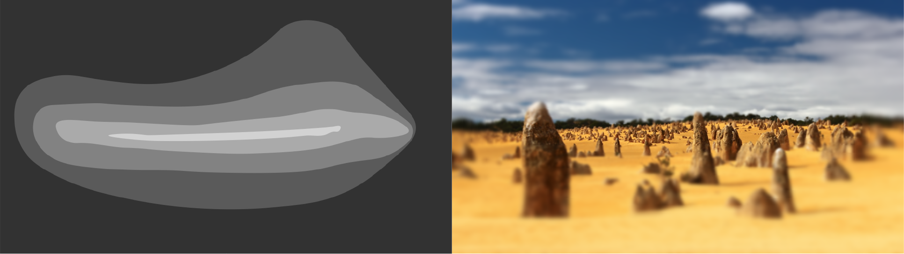

# foveate_blockwise
## Real-time image and video foveation transform using PyCUDA 

Foveation implementation using adaptive Gaussian blurring optimized for real-time performance, as described in *link*. 
The algorithm exploits the CUDA architecture to generate the foveated image in blocks of varying blurring strength. 

Blurring strength throughout the image frame can be defined in one of two ways:

1. A circularly-symmetric function can be used to define the spatial frequency falloff with eccentricity from the fixation point - an implementation is provided based on parameters and psychometric functions sourced from [Wilson S. Geisler, Jeffrey S. Perry, "Real-time foveated multiresolution system for low-bandwidth video communication," Proc. SPIE 3299, Human Vision and Electronic Imaging III, (17 July 1998)](http://www.svi.cps.utexas.edu/spie1998.pdf).

2. A greyscale image can be used as a map of retinal ganglion cell (RGC) density distribution and therefore the blurring strength across the image frame. 

*Example of greyscale RGC map and its foveation transform:*


The fixation point (center of gaze) can be displaced anywhere in the visual field. 

We provide two demos:

1. **foveate_blockwise_track.py:** A real-time foveation demo where the fixation point follows the mouse cursor. 
2. **foveate_blockwise_draw.py:** Similar to the tracking demo, but the user first draws a greyscale RGC mapping before seeing it in action on an image. 

More information, including a detailed algorithm description and suggestions for modifications, is available here.

## Install

This implementation requires the [CUDA Toolkit](https://developer.nvidia.com/cuda-toolkit), [PyCUDA wrapper](https://pypi.org/project/pycuda/), and [OpenCV-Python](https://docs.opencv.org/master/da/df6/tutorial_py_table_of_contents_setup.html).

The PyCUDA wrapper and OpenCV-Python package can be installed using pip:

```
pip install -r requirements.txt
```

## Run

To foveate a single image:
```
python src/foveate_blockwise.py -v
```
To foveate and save a particular image, place it in the *images* directory, then specify its name with the `-i` parameter. To save the image use the `-o` option, and provide the output directory and filename:
```
python src/foveate_blockwise.py -i my_image.jpg -o output/fov_image.png
```

To run the tracking demo:
```
python src/foveate_blockwise_track.py 
```
To run the drawing demo:
```
python src/foveate_blockwise_draw.py
```

Other available options for each file can be found with the `-h` parameter:

* `-h, --help`:          Displays help
* `-p, --gazePosition`:  Gaze position coordinates, (vertical down) then (horizontal right), (e.g. `-p 512,512`)
* `-f, --fragmentSize`:  Width and height of fragments for foveation, (e.g. `-f 16,16`), default: 32 x 32
* `-v, --visualize`:     Show foveated images
* `-i, --inputFile`:     Input image from "images" folder
* `-o, --outputDir`:     Output directory and filename
