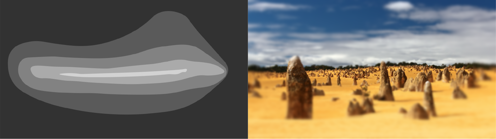

# foveate_blockwise
## Real-time image and video foveation transform using PyCUDA 

Foveation implementation using adaptive Gaussian blurring optimized for real-time performance, as described in *link*. 
The algorithm exploits the CUDA architecture to generate the foveated image in blocks of varying blurring strength. 

Blurring strength throughout the image frame can be defined in one of two ways:

1. A circularly-symmetric function can be used to define the spatial frequency falloff with eccentricity from the fixation point - an implementation is provided based on parameters and psychometric functions sourced from [Wilson S. Geisler, Jeffrey S. Perry, "Real-time foveated multiresolution system for low-bandwidth video communication," Proc. SPIE 3299, Human Vision and Electronic Imaging III, (17 July 1998)](http://www.svi.cps.utexas.edu/spie1998.pdf).

2. A greyscale image can be used as a map of retinal ganglion cell (RGC) density distribution and therefore the blurring strength across the image frame. 

The fixation point (center of gaze) can be displaced anywhere in the visual field. A real-time foveation demo is provided where the fixation point follows the mouse cursor (*demo1*). A second demo allows one to draw a greyscale RGC mapping before seeing it in action on a selected image (*demo2*). 

More information, including a detailed algorithm description and suggestions for modifications, is available here.

## Install

This implementation requires the [CUDA Toolkit](https://developer.nvidia.com/cuda-toolkit), [PyCUDA wrapper](https://pypi.org/project/pycuda/), and [OpenCV-Python](https://docs.opencv.org/master/da/df6/tutorial_py_table_of_contents_setup.html).

## Run

How to run demo
